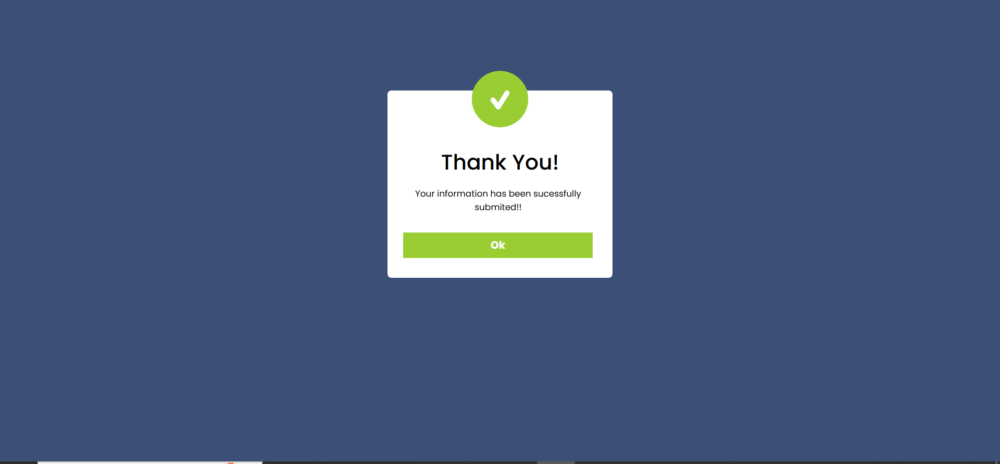

# 🎉 Modal Box Animation Project

This is a simple **Modal Box** project built using **HTML, CSS, and JavaScript**.  
It includes a smooth animation where the modal **slides down from the top** when opened and disappears when closed.

---

## 🚀 Features

- 📌 Click button to open modal
- 🎬 Smooth slide-down animation
- ❌ Close button functionality
- 🎨 Clean & responsive design
- ⚡ Built with pure **HTML, CSS, JavaScript** (no frameworks)

---

## 🛠️ Technologies Used

- **HTML5**
- **CSS3** (Animations, Transitions, Flexbox)
- **JavaScript (ES6)**

---

## 📷 Demo Preview

> click here button.  
> 

> Modal smoothly appears from the top and disappears when closed.  
> 

---

👨‍💻 **Author**

- Developed by ❤️ [Malik Musadiq Ahmed]

- Built with HTML, CSS, JavaScript only
